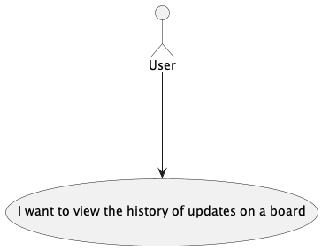
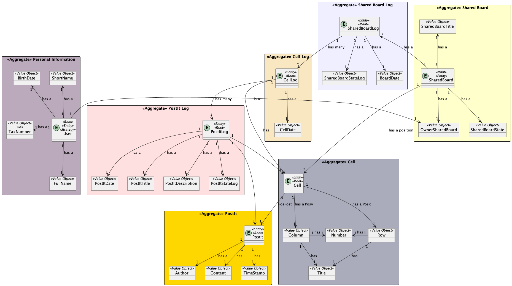
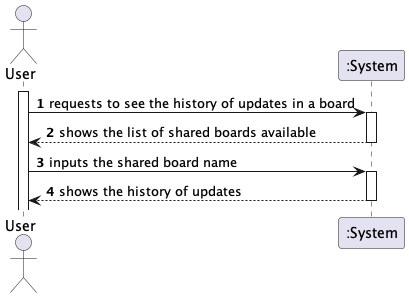
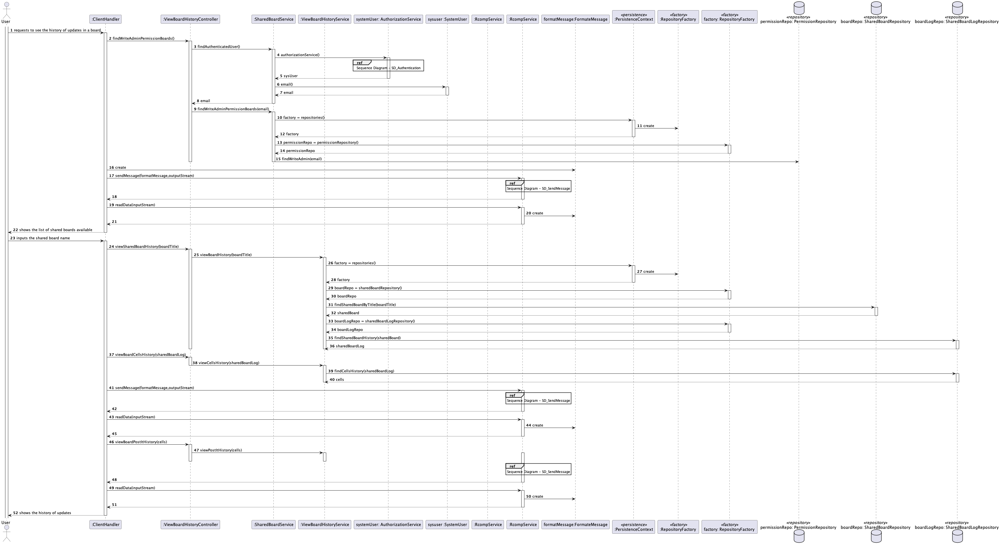
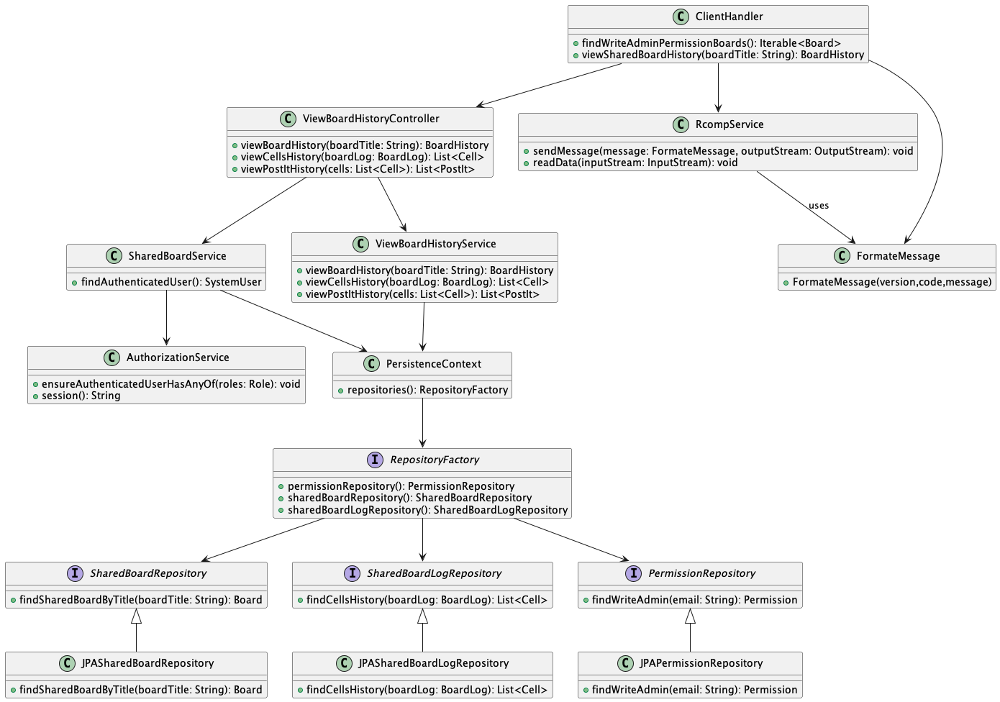

# US 3009 - As User, I want to view the history of updates on a board

## 1. Context

*Is the first time this task is assigned to be developed should be done by the end of the Sprint C.*

## 2. Requirements

> **US 3009** As User, I want to view the history of updates on a board

Related to...
> FRB07 - **View Board History** A user views a history of updates in a board
> NFR13 - **Design and Implement Shared Board Synchronization** This functional
part of the system has very specific technical requirements, particularly some concerns
about synchronization problems. In fact, several clients will try to concurrently update
boards. As such, the solution design and implementation must be based on threads,
condition variables and mutexes. Specific requirements will be provided in SCOMP
### 2.1 Found Out Dependencies

* There is a dependency with US3001, which is responsible for preparing the communication infrastructure for the Shared Boards and the deployment of the solution.
* There is a dependency with US3002, which is responsible for the creation of a shared board.
* There is a dependency with US3006, which is responsible for the creation of a board post-it.
* There is a dependency with US3007, which is responsible for changing the post-it.
* There is a dependency with US3008, which is responsible for undoing the last post-it changes.

### 2.2 Customer Specifications and Clarifications

**From the client clarifications:**
> **Question:** "In the requirements, it says that the system should maintain the history/log of all the updates on the board. There's someone specific that will be able to see those logs, or is it just something everyone that has access to the board can see?"
>
> **Answer:** "If a user as read access to the board he/she can view the history."
>


## 3. Analysis

### 3.1 Use Case Diagram



### 3.2 Relevant Domain Model Excerpt



## 3.3 System Sequence Diagram (SSD)



## 4. Design

Use the standard, layer-based application framework

* Domain classes: SharedBoard,SharedBoardLog,CellLog,PostItLog,EcourseUser
* Controller: ViewBoardHistoryController
* Repository: SharedBoardRepository,PermissionRepository,SharedBoardLogRepository
* Service: SharedBoardService,ViewHistoryBoardService, RcompService, FormatMessage

### 4.1. Realization (Sequence Diagram)



### 4.1.1 SD_SendMessage (SubSequence Diagram)

### 4.2. Class Diagram



### 4.3. Applied Patterns

* **Creator**
  > Provides a way to create objects without exposing the instantiation logic to the client code.
  > It separates the creation of objects from their use, and provides a way to easily extend the types of objects that
  can be created.

* **Repository**
  > To manage and store objects in a persistent data store.
  > It simplifies data access and decouples application components from data persistence technology.

* **Factory**
  > Provides an interface for creating objects, while hiding the implementation details from the client code.
  > It allows for flexibility and extensibility by delegating the responsibility of object creation to subclasses.

* DDD - Domain Driven Design.
  > The design of the project started right away with DDD in mind. The domain model was elaborated with the business
  rules and the DDD overlay for representing aggregates, entities and roots following the necessary rules.

* GRASP
  > With each representation of an actor or user story, GRASP was always taken into account, as it was a fundamental
  basis for the good development of the project.
  > Whether it's Information Expert, Low coupling/High cohesion or the controller concept, all these principles are very
  present in the minds of the group members.

* SOLID
  > The SOLID was mainly present with the Single Responsibility Principle, and the responsibilities that a class should
  have were always taken into account.
  > Already implemented with the base project of EAPLI, the Interface Seggregation Principle proved to be useful and
  enlightening, taking into account the different repositories that had to be created.


### 4.4 Message Exchange Flow between Server and Client
When client requests a request, over a TCP connection, the following communication flow follows:
1. Wait for the message from the Client.
2. Sends the Client the Understood Code.
3. Client requests the desired request through its associated code
4. Socket waits for message from client and checks which request to execute via code

<----------------------- Execution of Request----------------------->

To terminate the request, the server:
5. Waits for message from Client.
6. Sends the Client the Understood Code.
7. Closes the Socket.

### 4.4. Tests

```
@Test
    public void testReplaceId() {
        SharedBoardLog sharedBoardLog = new SharedBoardLog();
        Long newId = 1L;

        sharedBoardLog.replaceId(newId);

        Assertions.assertEquals(newId, sharedBoardLog.id());
    }

    @Test
    public void testReplaceDate() {
        SharedBoardLog sharedBoardLog = new SharedBoardLog();
        Calendar newDate = Calendar.getInstance();

        sharedBoardLog.replaceDate(newDate);

        Assertions.assertEquals(newDate, sharedBoardLog.date());
    }
      @Test
    public void testReplacePostItLogList() {
        CellLog cellLog = new CellLog();
        List<PostItLog> newPostItLogList = new ArrayList<>();

        cellLog.replacePostItLogList(newPostItLogList);

        Assertions.assertEquals(newPostItLogList, cellLog.postItLogList());
    }
````
```
 @Test
    void testGetCourses() {
        Set<Course> courses = new HashSet<>();
        courses.add(new Course(Designation.valueOf("Java"), Description.valueOf("Java - avancado"), Edition.valueOf("Edicao 1"), 10, 20));
        teacher.setCourses(courses);
        assertEquals(courses, teacher.getCourses());
    }
```

## 5. Implementation

*In this section the team should present, if necessary, some evidencies that the implementation is according to the
design. It should also describe and explain other important artifacts necessary to fully understand the implementation
like, for instance, configuration files.*

public class ClientHandler {
    
    private void viewBoardHistory(FormatMessage message) throws IOException {
        String sharedBoardList, cells;
        ViewBoardHistoryController viewBoardController = new ViewBoardHistoryController();
        sharedBoardList = String.join(",", viewBoardController.findWriteAdminPermissionBoards());

        rcompService.sendMessage(socket, new FormatMessage(1, 2, sharedBoardList), dataOutputStream);
        message = rcompService.readData(socket, dataInputStream);

        String sbTitle = message.message();
        SharedBoardLog boardLog = viewBoardController.viewSharedBoardHistory(sbTitle);

        if (boardLog == null) {
            rcompService.sendMessage(socket, new FormatMessage(1, SharedBoardUtils.ERR, "ERROR - Check the sharedboard name"), dataOutputStream);
        } else {
            rcompService.sendMessage(socket, new FormatMessage(1, SharedBoardUtils.ACK, boardLog.toString()), dataOutputStream);
        }

        List<CellLog> cellLogs = viewBoardController.viewBoardCellsHistory(boardLog);
        List<String> cellLogsStr = new ArrayList<>();
        message = rcompService.readData(socket, dataInputStream);
        if (message.code() == 10) {
            for (CellLog c : cellLogs) {
                cellLogsStr.add(String.valueOf(c.cell().identity()));
                cellLogsStr.add(String.valueOf(c.date().getTime()));

            }
            cells = String.join(",", cellLogsStr);
            rcompService.sendMessage(socket, new FormatMessage(1, 10, cells), dataOutputStream);
        }
        message = rcompService.readData(socket, dataInputStream);
        if (message.code() == 11) {
           String postItLogsStr = viewBoardController.viewBoardPostItHistory(cellLogs);
            rcompService.sendMessage(socket, new FormatMessage(1, 11, postItLogsStr), dataOutputStream);
        }

    }

}
public class ViewBoardHistoryService {
        
    public ViewBoardHistoryService() {
        RepositoryFactory rep = PersistenceContext.repositories();
        this.boardLogRepo = rep.sharedBoardLogRepository();
        this.cellLogRepo = rep.cellLogRepository();
        this.postItLogRepo = rep.postItLogRepository();
        this.boardRepo = rep.sharedBoardRepository();
    }

    public SharedBoardLog viewBoardHistory(String boardTitle){
        return boardLogRepo.findSharedBoardHistory(boardRepo.findSharedBoardByTitle(Designation.valueOf(boardTitle)));
    }
    public List<CellLog> viewCellsHistory(SharedBoardLog boardLog){
        return boardLogRepo.findCellsHistory(boardLog);
    }
    public String viewPostItHistory(List<CellLog> cellLogs){
        List<String> postItLogListStr = new ArrayList<>();
        for (CellLog c : cellLogs) {
            for (PostItLog postItLog : c.postItLogList()) {
                postItLogListStr.add(postItLog.cell().identity().toString());
                postItLogListStr.add(postItLog.postIt().identity().toString());
                postItLogListStr.add(postItLog.postItStateLog().toString());
                postItLogListStr.add(postItLog.date().getTime().toString());
            }
        }
       return String.join(",", postItLogListStr);
    }
}


*It is also a best practice to include a listing (with a brief summary) of the major commits regarding this
requirement.*
List of some commits:

    US3009 - Design (CD)
    #43
    @aliceresende

    US2009 - Requirements and Analysis(UCD,MD SSD)
    #43
    @aliceresende


## 6. Integration/Demonstration

To execute this US was needed all PostIt and Shared Board USs.

Within this US, the following requests are made:

| Code | Request                |
|------|------------------------|
| 2    | Acknowledgment message |
| 3    | Error message          |
| 9    | Board history updates  |
| 10   | Cells history updates  |
| 11   | PostIt history updates |


## 7. Observations

The User Story was fully developed, with success.